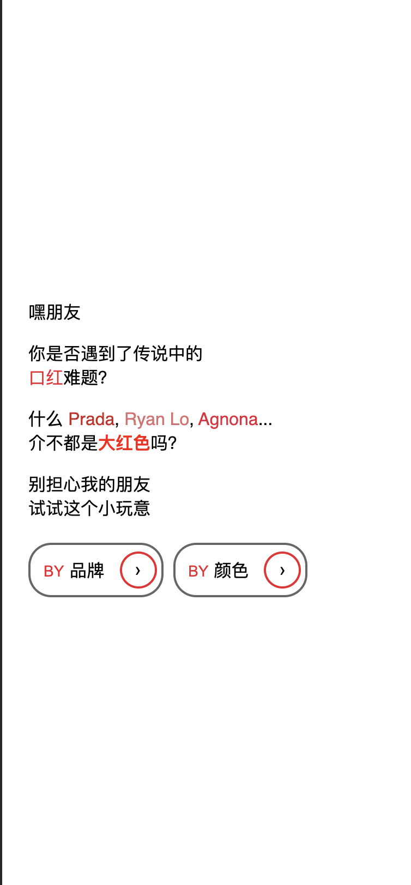
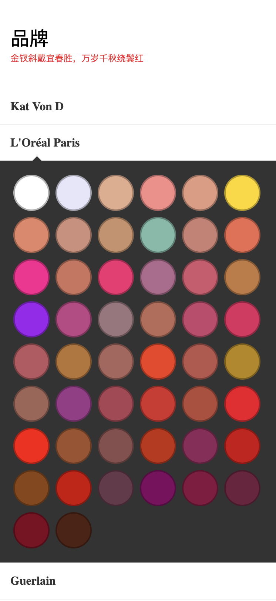
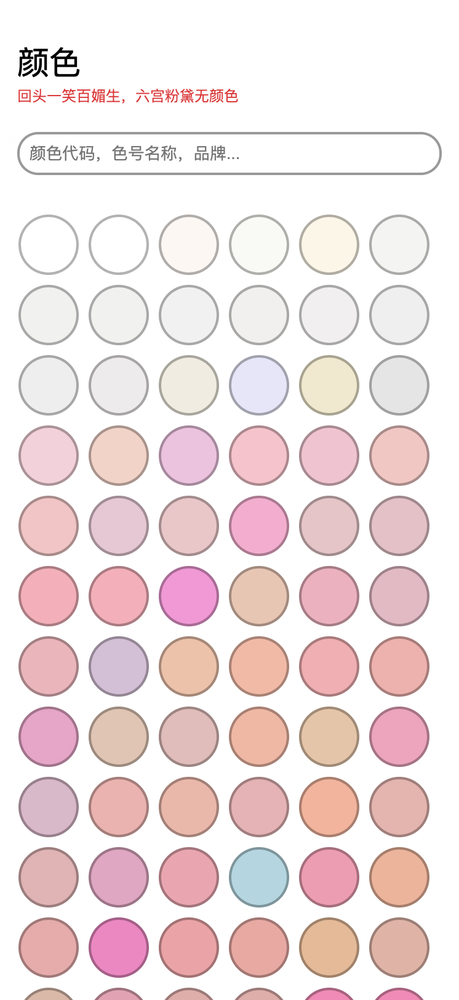
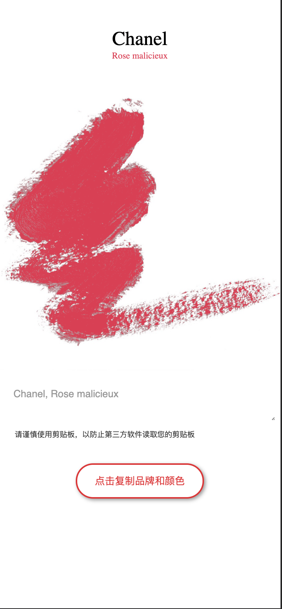

# 口红色号找寻器💄
## 点这 [首页](https://zixiaowang.github.io/lipsticks/) 开启口红色号找寻之旅。
## 👉 这是啥？
钢铁直男必备，可以通过口红品牌直达色号，或者通过颜色直达品牌。

<table>
 <tr>
    <td></td>
    <td></td>
    <td></td>
    <td></td>
 </tr>
</table>

## 👉 搞这个干嘛？
受到 [Ovilia](https://github.com/Ovilia) 小姐姐的 [lipsitck 口红颜色可视化](https://github.com/Ovilia/lipstick) 这个 repo 的启发，我也想搞一个手机端友好，并加入一定搜索功能。后来就有了这个 repo。传送门 >> [首页](https://zixiaowang.github.io/lipsticks/)

## License
[MIT License](./license.txt)